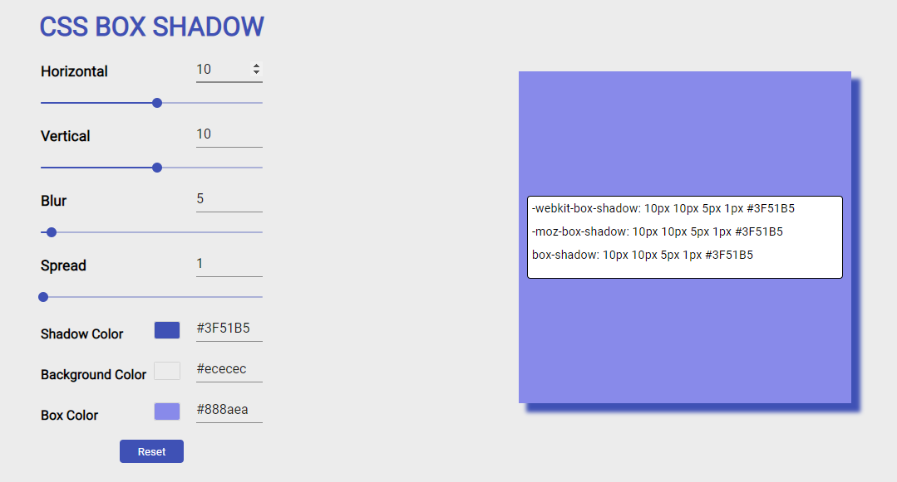

# [](https://travis-ci.org/npm/npm) [](https://yarnpkg.com/) [](https://github.com/your/your-project/blob/master/LICENSE)

# Gerador de código CSS para box shadow.

### A aplicação consiste em exibir o efeito do box-shadow e o código css.

Para testar a aplicação [clique aqui](https://boxshadow.netlify.app/) ou na imagem abaixo:

[](https://boxshadow.netlify.app/)

<br />

# Iniciando o projeto localmente

### Para executar o projeto é necessário realizar o clone do repositorio

```shell
git clone https://github.com/jonlima2018/box-shadow.git
```

### Após realizar o clone do projeto, abra o terminal, acesse a pasta **box-shadow** e instale as dependências

```shell
cd challengebcredi/
yarn install
```

### Finalizado os passos anteriores, ainda com o terminal aberto na pasta do projeto, execute o comando:

```shell
yarn start
```

# Desenvolvimento

## Principais libs/frameworks

### O projeto foi desenvolvido com React v16.13, TypeScript e também utilizado as bibliotecas abaixo:

<br />

<!--ts-->

#### Picker

-   [React-color](https://casesandberg.github.io/react-color/)

#### Material Design

-   [Material-UI](https://material-ui.com/pt/)

#### Estilização Css in JS

-   [Styled-components](https://styled-components.com/)

#### Padrão de codificação

-   [Eslint Airbnb](https://eslint.org/)

#### Tipagem

-   [TypeScript](https://www.typescriptlang.org/)
<!--te-->

## Pré Requisitos Dev

<!--ts-->

-   [Node](https://nodejs.org/en/)
-   [Yarn](https://yarnpkg.com/)
-   [Eslint](https://eslint.org/)
<!--te-->
